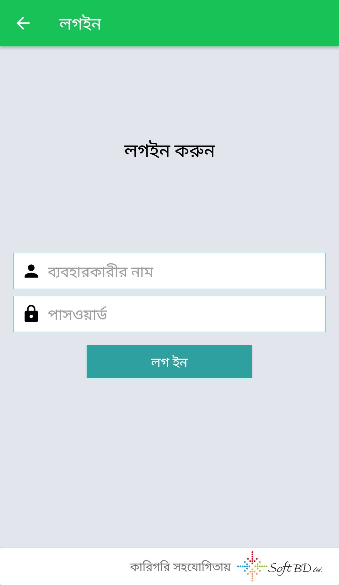
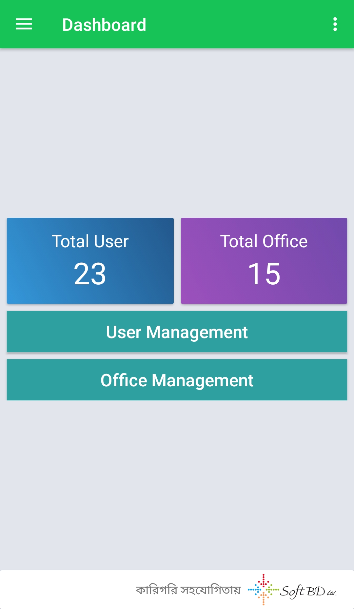
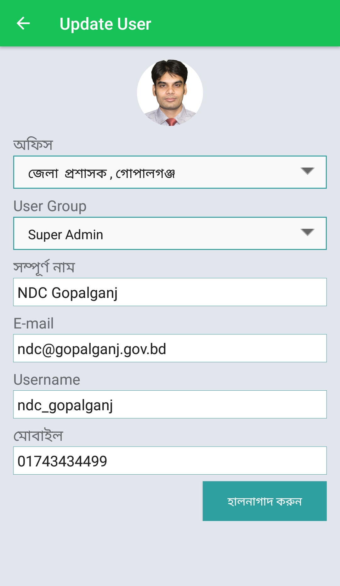
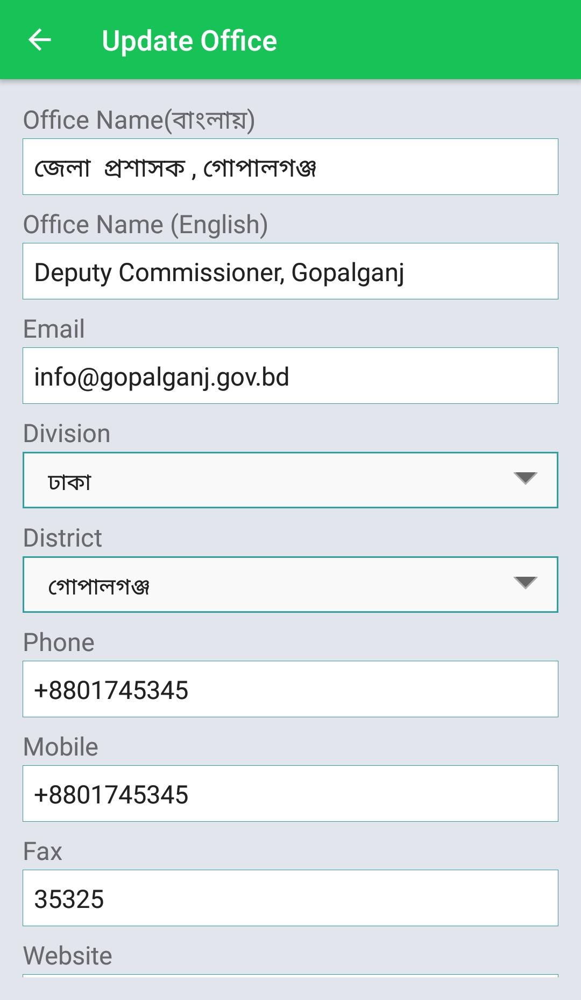
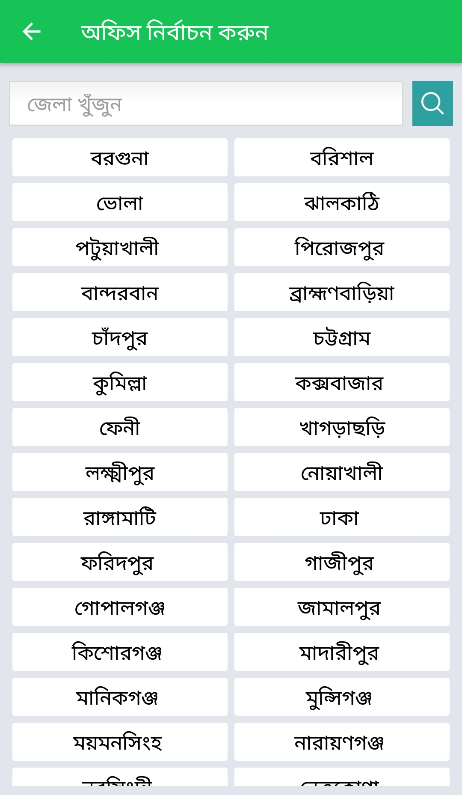
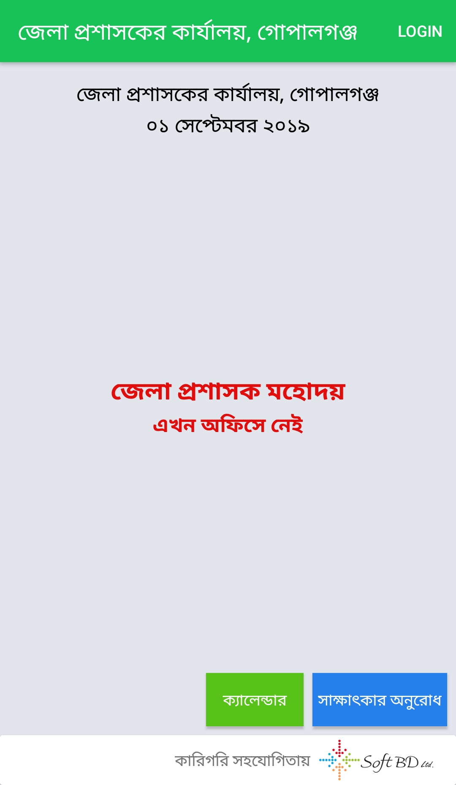
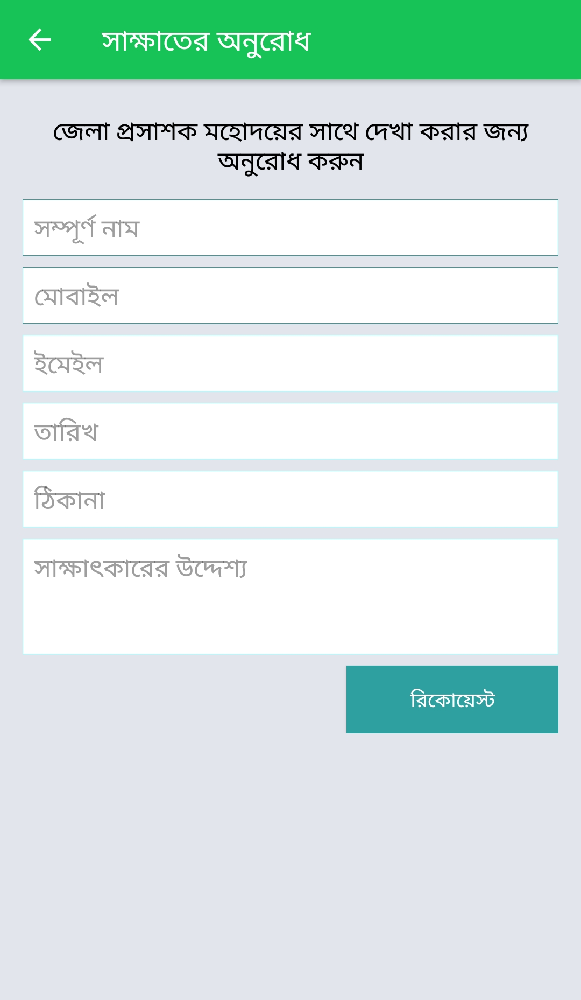
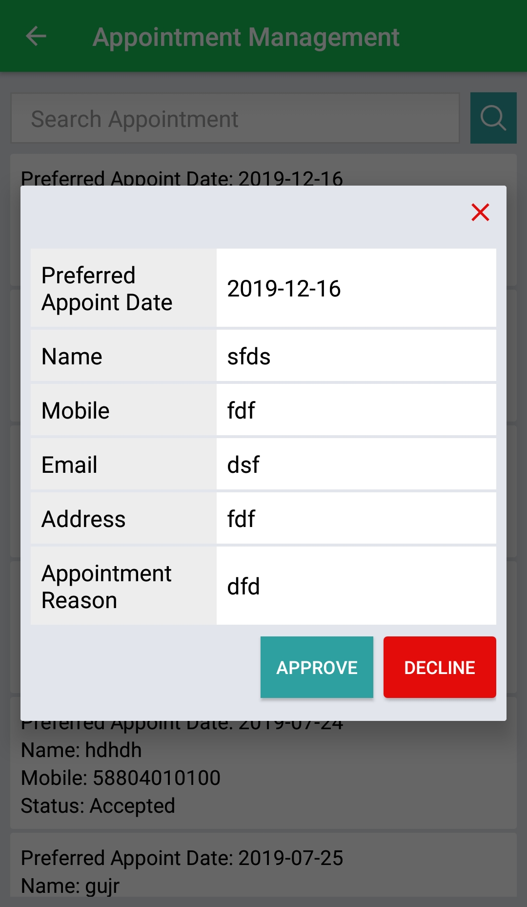
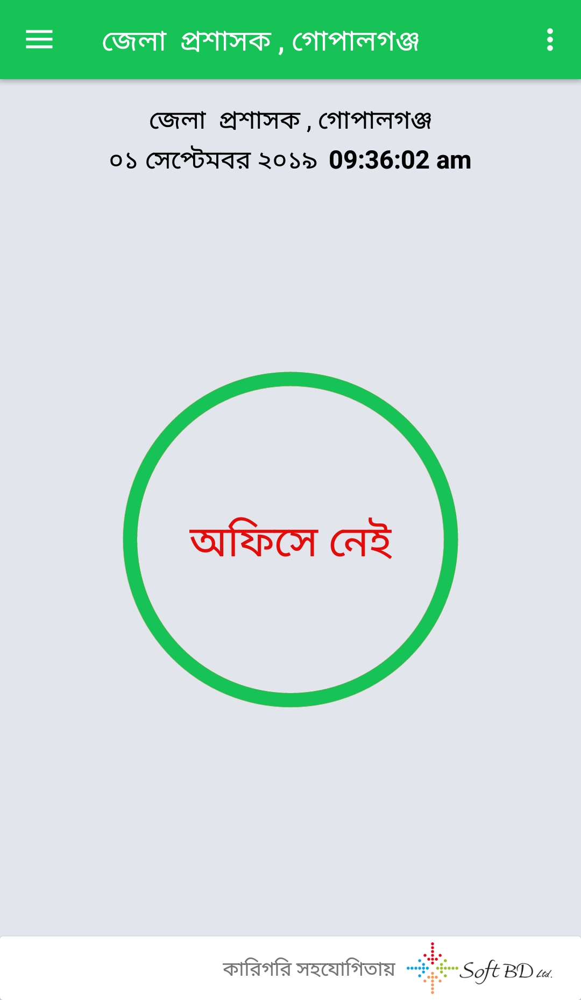

# talk-to-DC
This project is aimed to get an appointment from Deputy commissioner, request for an appointment and also show Deputy commissioner will
stay or not in hisor her office from the user end. 
There are some view of my project: 

Splashscreen 
  
Login view 
  
Dashboard 
  
Add user 
  
Add office 
  
Select office 
  
Show DC office condition 
  
Appoinment request form 
  
request approve or reject view 
  
Add DC stay or not
  

